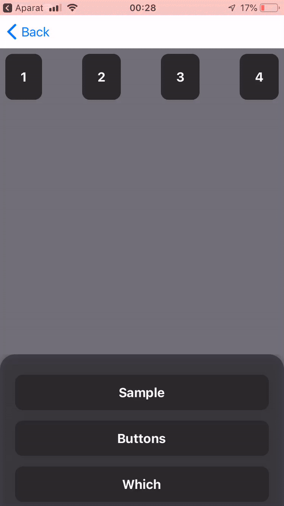

# Reanimated Bottom Sheet
Highly configurable component imitating [native bottom sheet behavior](https://material.io/design/components/sheets-bottom.html#standard-bottom-sheet), with fully native 60 FPS animations!

Built from scratch with [react-native-gesture-handler](https://github.com/kmagiera/react-native-gesture-handler) and [react-native-reanimated](https://github.com/kmagiera/react-native-reanimated).

Usable with Expo with no extra native dependencies!

  |   |    |    |
:---------------:|:----------------:|:-----------------:|:-----------------:|


## Installation

Open a Terminal in the project root and run:

```sh
yarn add reanimated-bottom-sheet
```

Or if you use npm:

```sh
npm install reanimated-bottom-sheet
```

Now we need to install [`react-native-gesture-handler`](https://github.com/kmagiera/react-native-gesture-handler) and [`react-native-reanimated`](https://github.com/kmagiera/react-native-reanimated).

If you are using Expo, to ensure that you get the compatible versions of the libraries, run:

```sh
expo install react-native-gesture-handler react-native-reanimated
```

If you are not using Expo, run the following:

```sh
yarn add react-native-reanimated react-native-gesture-handler
```

Or if you use npm:

```sh
npm install react-native-reanimated react-native-gesture-handler
```

We're done! Now you can build and run the app on your device/simulator.

## Usage

```javascript
import * as React from 'react';
import { StyleSheet, Text, View, Button } from 'react-native';
import Animated from 'react-native-reanimated';
import BottomSheet from 'reanimated-bottom-sheet';

export default function App() {
  const renderContent = () => (
    <View
      style={{
        backgroundColor: 'white',
        padding: 16,
        height: 450,
      }}
    >
      <Text>Swipe down to close</Text>
    </View>
  );

  const sheetRef = React.useRef(null);

  return (
    <>
      <View
        style={{
          flex: 1,
          backgroundColor: 'papayawhip',
          alignItems: 'center',
          justifyContent: 'center',
        }}
      >
        <Button
          title="Open Bottom Sheet"
          onPress={() => sheetRef.current.snapTo(0)}
        />
      </View>
      <BottomSheet
        ref={sheetRef}
        snapPoints={[450, 300, 0]}
        borderRadius={10}
        renderContent={renderContent}
      />
    </>
  );
}
```

## Props

| name                      | required | default | description |
| ------------------------- | -------- | ------- | ------------|
| snapPoints                | yes      |         | E.g. `[300, 200, 0]`. Points for snapping of bottom sheet coomponent. They define distance from bottom of the screen. Might be number or percent (as string e.g. `'20%'`) for points or percents of screen height from bottom. Note: Array values must be in descending order. |
| initialSnap               | no       |    0    | Determines initial snap point of bottom sheet. The value is the index from snapPoints. |
| renderContent             | no       |         | Method for rendering scrollable content of bottom sheet. |
| renderHeader              | no       |         | Method for rendering non-scrollable header of bottom sheet. |
| enabledGestureInteraction | no       | `true`  | Defines if bottom sheet could be scrollable by gesture. |
| enabledHeaderGestureInteraction | no       | `true`  | Defines if bottom sheet header could be scrollable by gesture. |
| enabledContentGestureInteraction | no       | `true`  | Defines if bottom sheet content could be scrollable by gesture. |
| enabledContentTapInteraction | no       | `true`  | Defines whether bottom sheet content could be tapped. **Note:** If you use `Touchable*` components inside your `renderContent`, you'll have to switch this to `false` to make handlers like `onPress` work. (See [this comment](https://github.com/osdnk/react-native-reanimated-bottom-sheet/issues/219#issuecomment-625894292).) |
| enabledManualSnapping     | no       | `true`  | If `false` blocks snapping using `snapTo` method. |
| enabledBottomClamp        | no       | `false` | If `true` block movement is clamped from bottom to minimal snapPoint. |
| enabledBottomInitialAnimation        | no       | `false` | If `true` sheet will grows up from bottom to initial snapPoint. |
| enabledInnerScrolling     | no       | `true`  | Defines whether it's possible to scroll inner content of bottom sheet. |
| callbackNode              | no       |         | `reanimated` node which holds position of bottom sheet, where `0` it the highest snap point and `1` is the lowest. |
| contentPosition           | no       |         | `reanimated` node which holds position of bottom sheet's content (in dp) |
| headerPosition           | no       |         | `reanimated` node which holds position of bottom sheet's header (in dp) |
| overdragResistanceFactor  | no       |   0     | `Defines how violently sheet has to stopped while overdragging. 0 means no overdrag |
| springConfig              | no       | `{ }`   | Overrides config for spring animation |
| innerGestureHandlerRefs   | no       |         | Refs for gesture handlers used for building bottom sheet. The array consists fo three refs. The first for PanGH used for inner content scrolling. The second for PanGH used for header. The third for TapGH used for stopping scrolling the content.   |
| simultaneousHandlers | no       |         | Accepts a react ref object or an array of refs to handler components. |
| onOpenStart | no       |         | Accepts a function to be called when the bottom sheet starts to open. |
| onOpenEnd | no       |         | Accepts a function to be called when the bottom sheet is almost fully openned. |
| onCloseStart | no       |         | Accepts a function to be called when the bottom sheet starts to close. |
| onCloseEnd | no       |         | Accepts a function to be called when the bottom sheet is almost closing. |
| callbackThreshold | no       |    0.01     | Accepts a float value from 0 to 1 indicating the percentage (of the gesture movement) when the callbacks are gonna be called. |
| borderRadius | no       |        | Border radius of content wrapper (excluding header) |


## Methods

### `snapTo(index)`

Imperative method on for snapping to snap point in given index. E.g.

```javascript
// Snap to the snap point at index 0 (e.g. 450 in [450, 300, 0])
this.bottomSheetRef.current.snapTo(0)
```

Here `this.bottomSheetRef` refers [to the `ref`](https://reactjs.org/docs/react-api.html#reactcreateref) passed to the `BottomSheet` component.

## Example

More complex examples can be found in the `Example` folder. To view the examples in the [Expo app](https://expo.io/), open a Terminal and run:

```sh
yarn
yarn prepare
cd Example
yarn
expo start
```

The example app is also available on [Expo](https://expo.io/@osdnk/reanimated-bottomsheet-expample).

## Todo

It's not finished and some work has to be done yet.

1. Play with magic config values
2. Horizontal mode
3. Deal with GH in inner scrollView
4. Cleanup code (e.g. measuring of components)

## Contributing

### Publishing a release

We use [release-it](https://github.com/release-it/release-it) to automate our release. If you have publish access to the NPM package, run the following from the master branch to publish a new release:

```sh
yarn release
```

NOTE: You must have a `GITHUB_TOKEN` environment variable available. You can create a GitHub access token with the "repo" access [here](https://github.com/settings/tokens).
